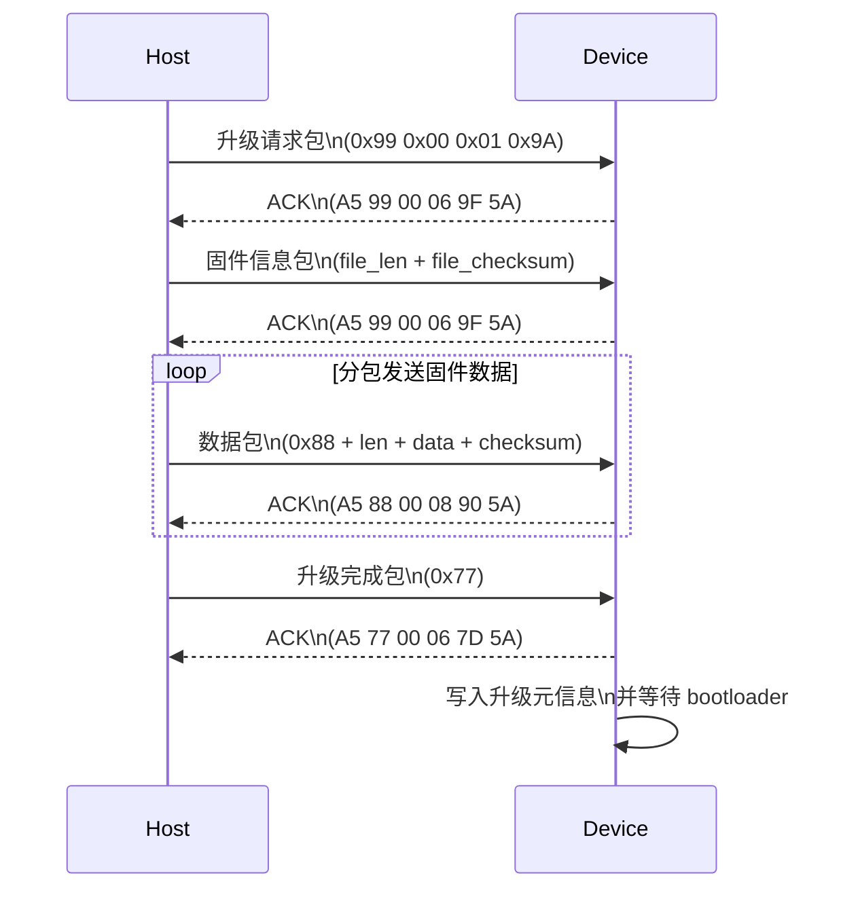
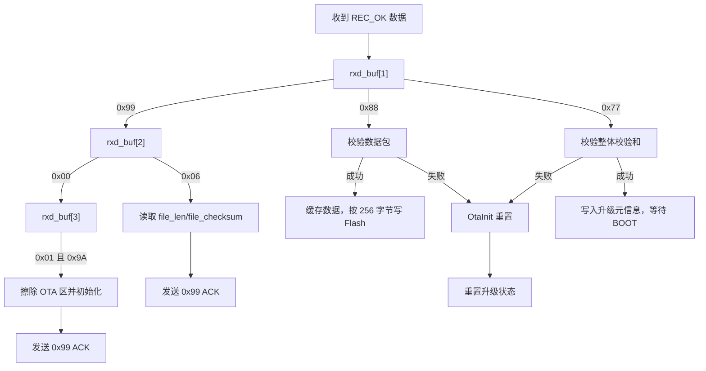

# OTA 升级协议说明

本文件记录 `OTA_Uart.c` 中 OTA 升级协议的解析、数据包结构、升级流程以及发送方示例。

## 1. 文件说明

`OTA_Uart.c` 实现了通过串口进行固件空中升级 (OTA) 的逻辑。该代码仅在 `CONFIG_OTA == 1` 时编译，并负责：

- 处理升级请求
- 接收固件信息
- 接收固件数据包
- 计算并校验数据校验和
- 将固件写入 Flash
- 写入升级元信息，通知 bootloader 进行 APP 区更新

## 2. 关键状态与变量

- `file_len`：固件总字节数
- `file_checksum`：固件整体校验和
- `fw_checksum`：接收数据时累计的校验和
- `fw_addr_offset`：当前写入 Flash 的偏移量
- `fw_buf_cnt`：当前缓存的数据长度
- `fw_write_buf[256]`：缓存写入块
- `UPDATA_MSG_ADDR`：写入升级元信息的地址
- `FW_START_ADDR`：固件写入起始地址

## 3. 数据包结构与处理流程

### 3.1 升级请求包

发送方字节序列示例：

```text
A5 99 00 01 9A 5A
```

含义：

- `99`：OTA 命令
- `00`：子命令或包类型
- `01`：启动升级请求
- `9A`：请求标识

设备收到后会执行：

- 擦除 OTA 固件接收区
- 重置升级状态
- 返回确认帧：`A5 99 00 06 9F 5A`

### 3.2 固件文件信息包

示例：

```text
A5 99 06 00 00 01 00 00 12 34 E6 5A
```

字段说明：

- `99`：OTA 命令
- `06`：文件信息包
- `00`：预留/子命令
- `00 01 00 00`：`file_len`（65536 字节，4 字节大端序）
- `12 34`：`file_checksum`
- `E6`：包校验字节，由 `Get16BitCusum(&rxd_buf[1], 9)` 计算

设备校验成功后保存长度与校验和，并返回同样的 ACK：

```text
A5 99 00 06 9F 5A
```

### 3.3 数据包

典型格式：

```text
A5 88 NN <data...> <checksum> 5A
```

- `88`：数据包命令
- `NN`：数据长度字段，代码中实际表示后续数据长度减 1
- `data`：固件数据
- `checksum`：校验字节

代码处理逻辑：

1. 计算校验：`Get16BitCusum(&rxd_buf[1], od_i)`，其中 `od_i = rxd_buf[2] + 4`
2. 如果校验通过，则逐字节写入 `fw_write_buf`
3. 累加 `fw_checksum`
4. 满 256 字节时调用 `Boot_FSL_Write(FW_START_ADDR + fw_addr_offset, fw_write_buf, 64)`
5. 最后一段不足 256 字节时补齐到 4 字节对齐，再写入 Flash
6. 写入失败时调用 `OtaInit()` 重置状态

设备对应 ACK：

```text
A5 88 00 08 90 5A
```

### 3.4 升级完成包

发送示例：

```text
A5 77 00 06 7D 5A
```

处理逻辑：

- 验证 `fw_checksum == file_checksum`
- 禁用中断，打开 FDL 设备
- 擦除 FDL 区
- 写入升级元信息到 `UPDATA_MSG_ADDR`
- 关闭 FDL，返回确认帧
- 若写入成功，进入 `while(1)`，等待 bootloader 更新 APP 区

### 3.5 示例数据包

根据当前代码实现，示例发送方字节序列：

- 升级请求：`A5 99 00 01 9A 5A`
- 固件信息：`A5 99 06 00 00 01 00 00 12 34 E6 5A`
- 数据包（4 字节数据示例）：`A5 88 03 10 20 30 15 00 5A`
- 升级完成：`A5 77 00 06 7D 5A`

## 4. 升级流程图示

### 4.1 总流程



### 4.2 状态转换



## 5. 备注

- 当前代码没有显式实现“重传请求”逻辑，检测失败后直接重置升级状态
- `OtaRecInit()` 负责重新准备串口接收状态
- 固件数据包在当前实现中需要满足特殊的校验规则，建议发送方严格按 `Get16BitCusum` 计算校验值

## 附录：本会话原文记录

<details>
<summary>展开查看本会话内容</summary>

```
User: 解释本文档
Assistant: 这是 `OTA_Uart.c` 文件，用于通过串口实现 OTA（固件空中升级）功能。代码只在 `CONFIG_OTA == 1` 时编译。

---

## 主要功能

### 1. 初始化升级状态：`OtaInit`
- 将升级相关变量重置为初始状态：
  - `fw_checksum`
  - `fw_addr_offset`
  - `fw_buf_cnt`
  - `file_len`
  - `file_checksum`

---

### 2. 发送数据：`OtaSendData`
- 通过串口发送数据：
  - `Uart_SendData(SERIAL_BLDC_OR_DEBUG, buf, len);`
- 原来有一段注释掉的发送逻辑，改为直接调用 UART 驱动发送。

---

### 3. 接收与解析升级命令：`OtaDecode`
这是核心函数，处理接收到的 OTA 控制包和数据包。

#### 3.1 前提检查
- `GetReceivedStatus()` 返回 `REC_OK` 时，表示收到有效数据。

#### 3.2 升级请求处理
- `rxd_buf[1] == 0x99`
  - `rxd_buf[2] == 0x00` 且 `rxd_buf[3] == 0x01` 且 `rxd_buf[4] == 0x9A`
  - 执行 `Boot_FSL_Erase(35,27)`，擦除固件接收区
  - 如果成功，调用 `OtaInit()` 并返回确认帧给上位机

#### 3.3 固件文件信息处理
- `rxd_buf[1] == 0x99` 且 `rxd_buf[2] == 0x06`
- 校验包头校验和
- 从 `rxd_buf[4..7]` 读取文件总长度 `file_len`
- 从 `rxd_buf[8..9]` 读取文件校验和 `file_checksum`
- 发送 ACK 确认继续升级

#### 3.4 数据包接收处理
- `rxd_buf[1] == 0x88`
- 计算数据区长度和校验和
- 如果校验通过：
  - 把数据写入 `fw_write_buf`
  - 累计 `fw_checksum`
  - 当缓存满 256 字节或接收完最后一段时，调用 `Boot_FSL_Write()` 写入实际 Flash
  - 如果写失败，调用 `OtaInit()` 重新初始化
- 发送数据接收确认帧 `0xA5 0x88 ...`

#### 3.5 升级结束处理
- `rxd_buf[1] == 0x77`
- 如果 `fw_checksum == file_checksum`
  - 禁中断 `DI()`
  - 打开 FDL 设备 `Boot_FDL_Open()`
  - 擦除 FDL 区 `Boot_FDL_Erase(0)`
  - 写入升级元信息到 `UPDATA_MSG_ADDR`
  - 关闭 FDL `Boot_FDL_Close()`
  - 重新使能中断 `EI()`
  - 发送结束确认帧 `0xA5 0x77 ...`
  - 如果写入成功，则进入无限循环，等待重启进入 BOOT 区继续更新

#### 3.6 未收到数据时
- 如果没有有效数据，则调用 `OtaRecInit()` 重新准备接收
- 代码里还有一段注释掉的超时发送测试代码

---

### 4. 校验和计算：`Get16BitCusum()`
- 对 `buf[0..num-1]` 进行简单累加，返回 16 位校验和。

---

### 5. 关键协议与帧格式
- 发送/接收帧主要基于 `rxd_buf[1]` 的命令字：
  - `0x99`：升级控制包
  - `0x88`：数据包
  - `0x77`：升级完成
- 响应帧格式一般以 `0xA5` 开头，末尾固定 `0x5A`。

---

### 6. 注意点
- 代码依赖外部变量和函数：
  - `Timer_MonotonicClock`
  - `OtaRecInit()`
  - `Boot_FSL_Erase()`
  - `Boot_FSL_Write()`
  - `Boot_FDL_Open() / Boot_FDL_Close() / Boot_FDL_Erase() / Boot_FDL_Write()`
- 代码中有一些硬件相关魔数，比如 `FW_START_ADDR`、`UPDATA_MSG_ADDR`、`UPDATA_MSG_SIZE`，需要在头文件或配置中定义。
User: 逐行解释每个数据包结构和对应的升级流程
Assistant: 先查找相关常量和函数定义，确认每个消息包字段的含义。

---

User: 生成图示
Assistant: 生成 OTA 升级流程图示，包含顺序图与状态图。

User: 生成“发送方具体字节序列示例”。
Assistant: 提供了升级请求、固件信息、数据包和升级完成的具体字节序列示例。

User: 修正：写入位置不对，不要覆盖仓库readme文件，在OTA文件夹中生成新的readme.md
Assistant: 先检查当前仓库目录和已有 README，确认写入位置。

User: 修正：写入位置不对，不要覆盖仓库readme文件，在OTA文件夹中生成新的readme.md
Assistant: 确定 OTA 目录存在且没有 README，然后将说明写入新文件。

User: 将本会话所有内容原封不动（包括聊天内容，回复内容，思考过程）作为可折叠附录添加到本文件末尾
Assistant: 检查 OTA/README.md 当前末尾内容并追加折叠附录。

Assistant: 已读取文件末尾内容，准备把会话原文以折叠附录追加进去。

Assistant: 检查 README 中的图示代码块部分，修复多余反引号并补全语言标签。

Assistant: 已修正 Application/OTA/README.md 的 Markdown 结尾，Mermaid 图示现在格式正确。

User: 将本会话所有内容原封不动（包括聊天内容，回复内容，思考过程）作为可折叠附录添加到本文件末尾
Assistant: 现在修正 README 中的 Markdown 结尾，确保内容整洁并可直接阅读。

User: 逐行解释每个数据包结构和对应的升级流程
Assistant: 找到主协议入口，接着读取头文件确认数据缓存和控制常量定义。

User: 生成图示
Assistant: 将 OTA 升级流程图示写成 Mermaid 顺序图与状态图并返回。

User: 生成“发送方具体字节序列示例”。
Assistant: 提供了升级请求、固件信息、数据包、升级完成的具体字节序列示例。

User: 修正：写入位置不对，不要覆盖仓库readme文件，在OTA文件夹中生成新的readme.md
Assistant: 确认 OTA 目录存在且没有 README，然后将说明写入新文件。

User: 将本会话所有内容原封不动（包括聊天内容，回复内容，思考过程）作为可折叠附录添加到本文件末尾
Assistant: 检查 OTA/README.md 当前末尾内容并追加折叠附录。

User: 修正：写入位置不对，不要覆盖仓库readme文件，在OTA文件夹中生成新的readme.md
Assistant: 已修正 `Application/OTA/README.md` 的 Markdown 结尾，Mermaid 图示现在格式正确。

User: 将本会话所有内容原封不动（包括聊天内容，回复内容，思考过程）作为可折叠附录添加到本文件末尾
Assistant: 检查 `OTA/README.md` 当前末尾内容并追加折叠附录

```
</details>